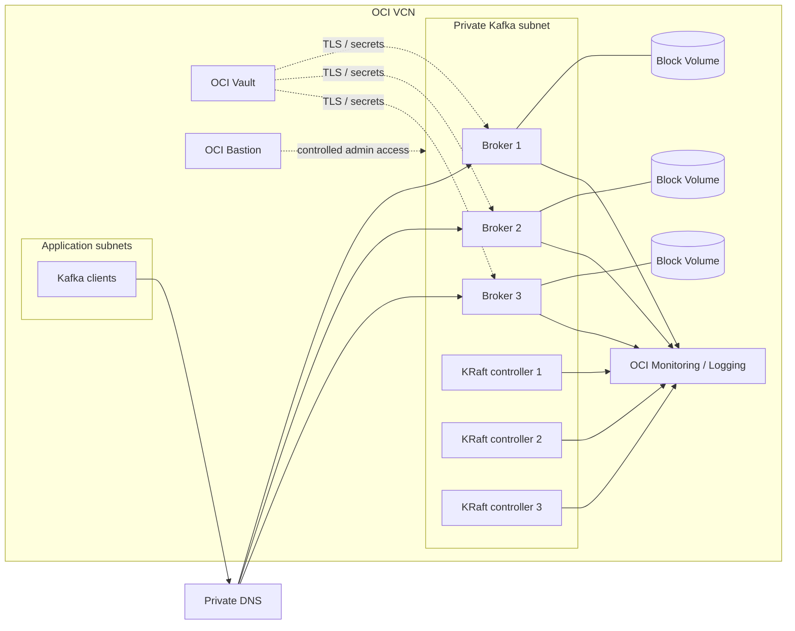

# Kafka on OCI — Reference Architecture

A reliability-focused reference design for running Apache Kafka on Oracle Cloud Infrastructure (OCI), with emphasis on private networking, repeatable infrastructure, observability, failure handling, and operational clarity.

> **Project status:** architecture and operations scaffold. Infrastructure automation is intentionally not represented as production-ready until the Terraform/provisioning implementation and validation are added.

## Goals

- Keep Kafka brokers off the public Internet.
- Spread failure domains so a single host or fault-domain event does not remove quorum.
- Make infrastructure reproducible and reviewable.
- Treat monitoring, capacity, recovery, and security as first-class parts of the deployment.
- Provide a clear path from a small lab cluster to a production-oriented topology.

## Reference topology



For a small non-production environment, controller and broker roles may be combined. A production deployment should evaluate dedicated KRaft controllers and at least three brokers based on workload, availability requirements, and failure-domain layout.

## OCI building blocks

| Concern | OCI component | Notes |
| --- | --- | --- |
| Network isolation | VCN + private subnets | Brokers and controllers should not require public IPs. |
| Traffic policy | Network Security Groups | Restrict client, replication, controller, metrics, and admin paths explicitly. |
| Name resolution | Private DNS | Stable broker/controller names simplify advertised listeners and automation. |
| Compute | OCI Compute | Shape selection should be driven by throughput, network bandwidth, and memory requirements. |
| Kafka data | Block Volumes | Keep Kafka data on dedicated mounts; size for retention and peak write rate. |
| Secrets | OCI Vault | Store TLS/private material and other deployment secrets outside source control. |
| Administration | OCI Bastion | Prefer time-bounded access rather than permanently exposed SSH endpoints. |
| Metrics / logs | OCI Monitoring + Logging | Supplement with Kafka/JVM exporters when deeper broker metrics are required. |
| Infrastructure | Terraform | Planned source of truth for VCN, NSGs, compute, volumes, DNS, and supporting services. |

## Network model

Kafka depends on clients being able to resolve and reach the broker addresses returned in metadata. The design therefore favors direct private connectivity to broker listeners rather than treating a generic load balancer as a substitute for correct `advertised.listeners` configuration.

Suggested traffic classes:

- **Client traffic:** application subnets → broker listener.
- **Inter-broker traffic:** broker NSG → broker NSG.
- **KRaft quorum:** controller/broker members → controller listener.
- **Metrics:** monitoring/collector hosts → exporter/JMX endpoint.
- **Administration:** time-bounded bastion path → approved management ports.

No rule should default to broad `0.0.0.0/0` access for Kafka listeners.

## Availability model

A minimum resilient deployment should account for:

- three KRaft voting members;
- three or more brokers for replicated topics;
- placement across OCI fault domains where available;
- replication factor of 3 for important topics;
- `min.insync.replicas` chosen so acknowledged writes retain the intended durability guarantee;
- rack/failure-domain awareness when assigning replicas;
- enough spare disk and network capacity to survive replica recovery after a broker loss.

Availability is not only broker count. Recovery bandwidth, disk headroom, controller quorum, DNS, secrets, and client retry behavior all affect the real failure envelope.

## Storage and capacity

Kafka capacity should be estimated before selecting shapes and volume sizes.

Approximate retained data requirement:

```text
retained_bytes ≈ ingress_bytes_per_second × retention_seconds × replication_factor
```

Then add headroom for:

- traffic spikes;
- compaction overhead;
- partition movement and replica rebuilds;
- filesystem and operational reserve;
- growth between planned capacity reviews.

Operational thresholds should alert well before a volume approaches exhaustion. A broker that cannot append safely is an availability event, not merely a storage event.

## Security baseline

- Keep brokers/controllers on private addresses.
- Use TLS for client and inter-node traffic where required by the environment.
- Store secret material in OCI Vault or another approved secret store.
- Restrict NSGs by source and purpose.
- Avoid static cloud credentials on instances; prefer instance principals/dynamic groups where OCI API access is needed.
- Separate human administration from application traffic.
- Record certificate rotation and credential rotation in the operational runbook.
- Never commit private keys, credentials, tokens, or generated secret values.

## Observability

A useful Kafka dashboard should cover both platform health and workload pressure.

### Cluster signals

- broker/controller availability;
- active controller / quorum health;
- under-replicated partitions;
- offline partitions;
- ISR shrink/expand rate;
- request latency and error rate;
- produce/fetch throughput;
- request-handler and network-thread utilization.

### Host/JVM signals

- disk utilization and disk latency;
- network throughput/errors;
- CPU saturation;
- memory pressure;
- JVM heap usage;
- garbage collection duration/frequency;
- file descriptor usage.

### Capacity signals

- bytes in/out by broker;
- partition count and skew;
- retention growth;
- consumer lag for critical consumer groups;
- estimated time-to-full at current storage growth.

## Suggested SLO-oriented alerts

Avoid paging on every noisy metric. Page on symptoms likely to affect durability or availability, and ticket lower-priority capacity signals.

Examples:

- offline partitions > 0;
- controller/quorum instability;
- sustained under-replicated partitions;
- broker unavailable;
- disk exhaustion forecast inside the operational response window;
- critical consumer lag outside agreed workload SLO;
- sustained produce/fetch errors or latency breach.

## Deployment phases

### Phase 1 — infrastructure foundation

- [ ] Terraform provider and version constraints
- [ ] VCN, private subnets, route tables and NSGs
- [ ] compute instances and fault-domain placement
- [ ] block volumes and mounts
- [ ] private DNS records
- [ ] Vault/dynamic-group policies where required

### Phase 2 — Kafka provisioning

- [ ] Kafka/JDK installation automation
- [ ] KRaft cluster identity/bootstrap
- [ ] broker/controller configuration templates
- [ ] TLS and authentication configuration
- [ ] systemd services and restart policy
- [ ] idempotent configuration management

### Phase 3 — validation

- [ ] cluster quorum check
- [ ] create replicated test topic
- [ ] producer/consumer smoke test
- [ ] broker-loss test
- [ ] controller-loss test
- [ ] replica recovery observation
- [ ] restart/reboot validation

### Phase 4 — operations

- [ ] dashboards and alerts
- [ ] backup/export or cross-cluster recovery strategy
- [ ] upgrade procedure
- [ ] certificate/secret rotation
- [ ] capacity review process
- [ ] incident runbook exercises

## Failure scenarios to test

A deployment should not be considered production-ready until expected behavior is known for at least:

1. one broker process failure;
2. one broker instance failure;
3. one KRaft controller loss;
4. one fault-domain disruption;
5. full disk on a broker;
6. client DNS/connectivity failure;
7. certificate expiration/rotation;
8. rolling Kafka upgrade;
9. replica rebuild under normal production load.

See [`docs/operations-runbook.md`](docs/operations-runbook.md) for the initial response checklist.

## Implementation direction

The intended implementation path is:

```text
Terraform
  -> OCI network / compute / storage / DNS / identity
  -> provisioning or configuration-management layer
  -> Kafka KRaft configuration
  -> metrics/logging
  -> automated smoke and failure tests
```

Future code should keep infrastructure construction separate from Kafka runtime configuration so each layer can be tested and replaced independently.

## Non-goals

This repository does not aim to hide Kafka's operational complexity behind a single opaque deployment command. The objective is a transparent, auditable deployment that makes networking, quorum, replication, capacity, and recovery decisions explicit.

## License

See [LICENSE](LICENSE).
